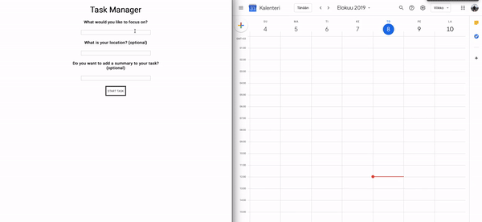

# Task Manager
This app lets you record your ongoing tasks to google calendar.

# How to run

* Turn on the Google Calendar API and download your credentials.json.
  * [Instructions](https://developers.google.com/calendar/quickstart/python)
* Setup virtual environment
* Activate it
* Install required modules from requirements.txt with ``` pip install -r /path/to/requirements.txt ```
* Run it through cmd with ``` python app.py ```




